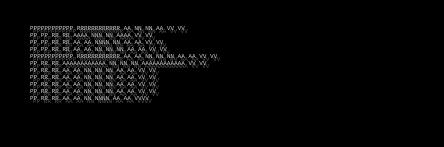

<!-- hero: monochrome ASCII portrait (types in) beside the extruded 3d ascii
     wordmark (wipes in left-to-right, then rocks on its vertical axis).
     portrait: python scripts/make_ascii_svg.py <photo>
     wordmark: python scripts/make_wordmark_svg.py PRANAV -->

<h3><code>pranav@github ~ $ whoami</code></h3>

<table>
<tr>
<td valign="top"></td>
<td valign="top"></td>
</tr>
</table>

 
 

<!-- animated contribution graph: real data, boxes reveal cell by cell
     python scripts/make_contrib_heatmap_svg.py pranavsource1 -->

<h3><code>pranav@github ~ $ ./contributions.sh</code></h3>

 
 

<!-- social links, rendered as a terminal prompt -->
<h3><code>pranav@github ~ $ ./links.sh</code></h3>

  &nbsp;
  &nbsp;
  &nbsp;
  

Building AI integrated products

